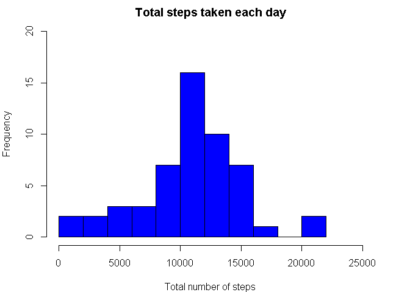
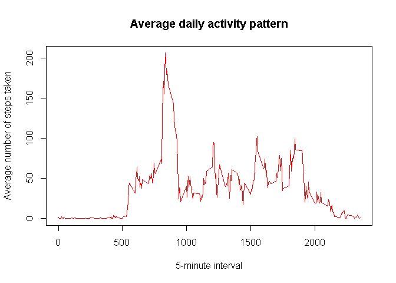
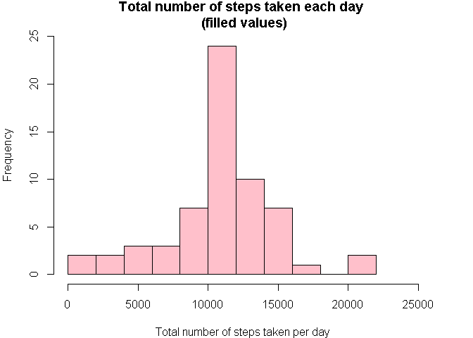
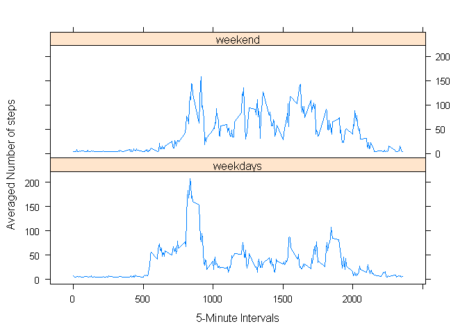

# Reproducible Research: Peer Assessment 1

---
title: "Reproducible Research: Peer Assessment 1"
output: 
  html_document:
    keep_md: true
---
## Preliminaries

### setting working directory, general options and loading  packages

```r
setwd("C:/Users/teo/Documents/RepData_PeerAssessment1")
library(lattice)
library(xtable)
library(knitr)
```


```r
opts_chunk$set(echo=TRUE, results="asis",fig.path="Figs/", warning=FALSE, message=FALSE)
```


## Loading and preprocessing the data

### 1. unzip and import data file to R

```r
unzip("activity.zip")
activity_data<-read.csv("activity.csv",header=TRUE, sep=",", na.strings="NA")
```

### 2. convert the "date"" variable to date format

```r
activity_data$date <- as.Date(activity_data$date)
class(activity_data$date)
```

[1] "Date"

### 3. summary of the "steps" and "interval" variables

```r
kable(summary(activity_data[,-2]), format = "markdown")
```


|   |    steps      |   interval    |
|:--|:--------------|:--------------|
|   |Min.   :  0.00 |Min.   :   0.0 |
|   |1st Qu.:  0.00 |1st Qu.: 588.8 |
|   |Median :  0.00 |Median :1177.5 |
|   |Mean   : 37.38 |Mean   :1177.5 |
|   |3rd Qu.: 12.00 |3rd Qu.:1766.2 |
|   |Max.   :806.00 |Max.   :2355.0 |
|   |NA's   :2304   |NA             |


## What is mean total number of steps taken per day?
### 1.Calculate the total number of steps taken per day

```r
total_steps_day <- tapply(activity_data$steps, activity_data$date, sum)
xtab1 <- xtable(t(summary(total_steps_day)),caption="summary total steps per day")
print(xtab1,type="html", include.rownames=FALSE, include.colnames=TRUE,caption.placement = "top")             
```

<!-- html table generated in R 3.1.2 by xtable 1.7-4 package -->
<!-- Sat Jul 18 09:31:08 2015 -->
<table border=1>
<caption align="top"> summary total steps per day </caption>
<tr> <th> Min. </th> <th> 1st Qu. </th> <th> Median </th> <th> Mean </th> <th> 3rd Qu. </th> <th> Max. </th> <th> NA's </th>  </tr>
  <tr> <td align="right"> 41.00 </td> <td align="right"> 8841.00 </td> <td align="right"> 10760.00 </td> <td align="right"> 10770.00 </td> <td align="right"> 13290.00 </td> <td align="right"> 21190.00 </td> <td align="right"> 8.00 </td> </tr>
   </table>

### 2.Make a histogram of the total number of steps taken each day

```r
par(mar=c(4,4,2,3))
hist(total_steps_day, breaks=11, xlim=c(0,25000), ylim=c(0,20), freq=TRUE, col= "blue", main="Total steps taken each day", xlab="Total number of steps")
```

 

### 3.Calculate and report the mean and median of the total number of steps taken per day
#### mean

```r
mean(total_steps_day, na.rm=TRUE)
```

[1] 10766.19

#### median

```r
median(total_steps_day, na.rm=TRUE)
```

[1] 10765


## What is the average daily activity pattern?
### 1.Make a time series plot (i.e. type = "l") of the 5-minute interval (x-axis) and the average number of steps taken, averaged across all days (y-axis)

```r
activity_pattern<- aggregate(activity_data$steps ~ activity_data$interval, activity_data, mean, na.rm=TRUE)
plot(activity_pattern,type="l",col="red",xlab="5-minute interval",pch=3, main= "Average daily activity pattern", ylab="Average number of steps taken")
```

 

### 2. Which 5-minute interval, on average across all the days in the dataset, contains the maximum number of steps?

```r
names(activity_pattern) <- c("Interval", "Average_Steps")
kable(activity_pattern[activity_pattern$Average_Steps==max(activity_pattern$Average_Steps),],format="markdown")
```


|    | Interval| Average_Steps|
|:---|--------:|-------------:|
|104 |      835|      206.1698|

## Imputing missing values
### 1. calculate and report the total number of missing values in the dataset

```r
kable(t(sapply(activity_data, function(x) sum(is.na(x)))),format="markdown")
```


| steps| date| interval|
|-----:|----:|--------:|
|  2304|    0|        0|

### 2. filling in all of the missing values in the dataset (use of mean to fill) and create a new dataset that is equal to the original dataset but with the missing data filled in.


```r
steps_filled<-activity_data
steps_filled$steps[is.na(steps_filled$steps)] <- mean(steps_filled$steps, na.rm=TRUE)
kable(summary(steps_filled),format="markdown")
```


|   |    steps      |     date          |   interval    |
|:--|:--------------|:------------------|:--------------|
|   |Min.   :  0.00 |Min.   :2012-10-01 |Min.   :   0.0 |
|   |1st Qu.:  0.00 |1st Qu.:2012-10-16 |1st Qu.: 588.8 |
|   |Median :  0.00 |Median :2012-10-31 |Median :1177.5 |
|   |Mean   : 37.38 |Mean   :2012-10-31 |Mean   :1177.5 |
|   |3rd Qu.: 37.38 |3rd Qu.:2012-11-15 |3rd Qu.:1766.2 |
|   |Max.   :806.00 |Max.   :2012-11-30 |Max.   :2355.0 |

### 4. Make a histogram of the total number of steps taken each day and Calculate and report the mean and median total number of steps taken per day. Do these values differ from the estimates from the first part of the assignment? What is the impact of imputing missing data on the estimates of the total daily number of steps?

```r
total_steps_fill <- tapply(steps_filled$steps, steps_filled$date, sum)
```


```r
par(mar=c(4,4,2,3))
hist(total_steps_fill, breaks=11, xlim=c(0,25000), ylim=c(0,25),freq=TRUE,col="pink", main="Total number of steps taken each day \n (filled values)",xlab="Total number of steps taken per day")
```

 


```r
mean(total_steps_fill)
```

[1] 10766.19


```r
median(total_steps_fill)
```

[1] 10766.19


```r
mean(total_steps_fill) - mean(total_steps_day, na.rm=TRUE)
```

[1] 0


```r
median(total_steps_fill) - median(total_steps_day, na.rm=TRUE)
```

[1] 1.188679

#### we notice that filling the NA observations with the mean value changed the value of the median but the overall
#### impact was not important


## Are there differences in activity patterns between weekdays and weekends?
### 1. create a new factor variable in the dataset with two levels – “weekday” and “weekend” indicating whether a given date is a weekday or weekend day.

```r
Sys.setlocale("LC_TIME", "English")
```

[1] "English_United States.1252"

```r
activity_days<-steps_filled
activity_days$week_<- weekdays(activity_days$date)
activity_days$week_[activity_days$week_=="Saturday"|activity_days$week_=="Sunday"] <- "weekend"
activity_days$week_[activity_days$week_=="Monday"|activity_days$week_=="Thursday"|activity_days$week_=="Wednesday"|activity_days$week_=="Tuesday"|activity_days$week_=="Friday"] <- "weekdays"
activity_days$week_<- as.factor(activity_days$week_)
kable(summary(activity_days[,-2]),format="markdown")
```


|   |    steps      |   interval    |     week_     |
|:--|:--------------|:--------------|:--------------|
|   |Min.   :  0.00 |Min.   :   0.0 |weekdays:12960 |
|   |1st Qu.:  0.00 |1st Qu.: 588.8 |weekend : 4608 |
|   |Median :  0.00 |Median :1177.5 |NA             |
|   |Mean   : 37.38 |Mean   :1177.5 |NA             |
|   |3rd Qu.: 37.38 |3rd Qu.:1766.2 |NA             |
|   |Max.   :806.00 |Max.   :2355.0 |NA             |

### Make a panel plot containing a time series plot (i.e. type = "l") of the 5-minute interval (x-axis) and the average number of steps taken, averaged across all weekday days or weekend days (y-axis).

```r
activity_avdays <- aggregate(steps ~ interval + week_, data=activity_days, mean)
xyplot(activity_avdays$steps ~ activity_avdays$interval | activity_avdays$week_,layout = c(1, 2), type = "l",xlab = "5-Minute Intervals", ylab = "Averaged Number of steps")
```

 

#### from the plot we see that in general there is more activity during weekends
